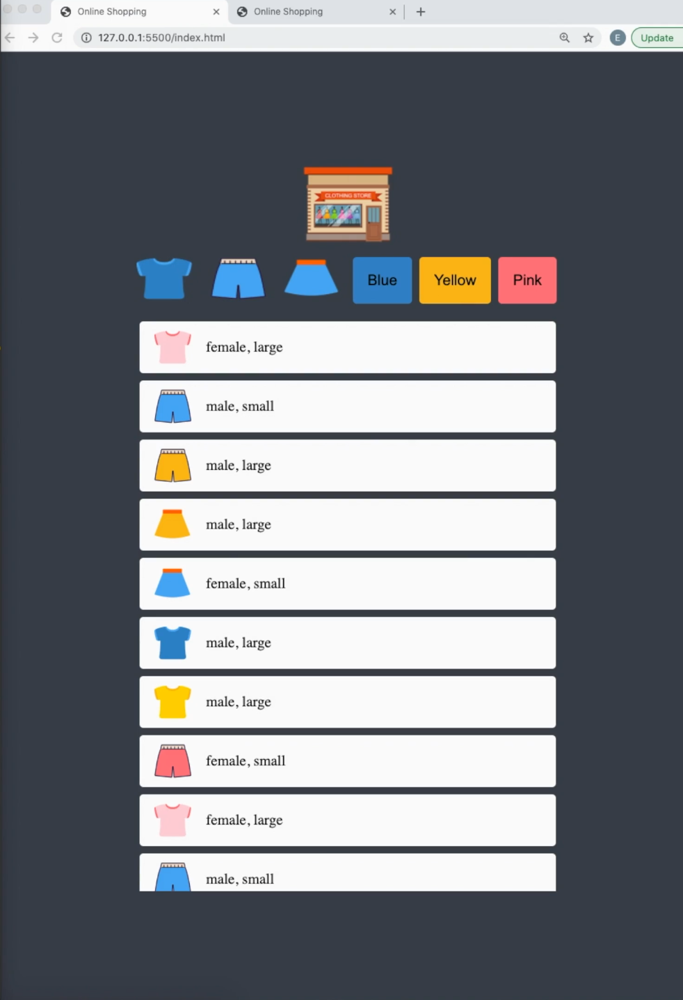
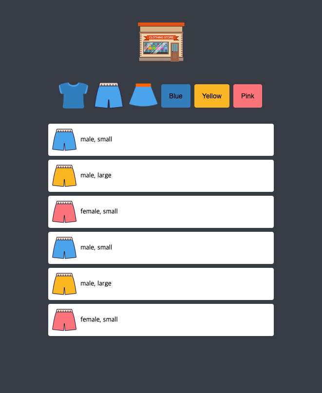
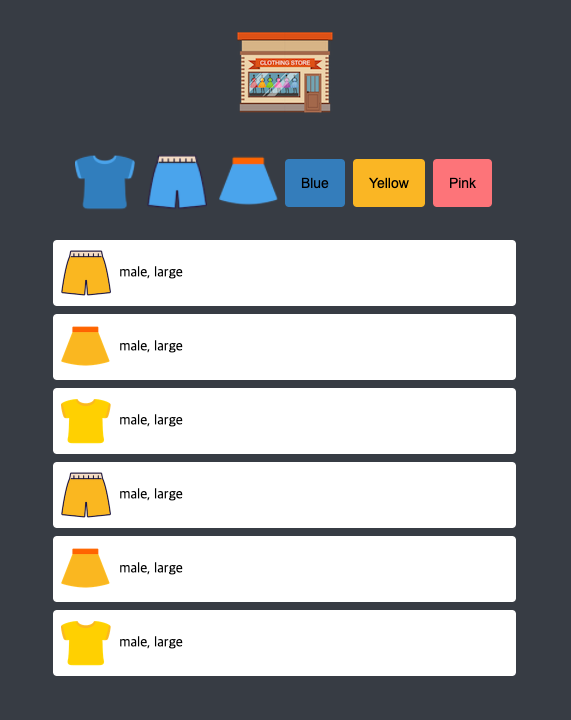

# mini-clothes-shop

🌈 **_자바스크립트 기초 공부를 위한 미니쇼핑물 구현_**

- HTML, CSS를 이용한 레이아웃 배치
- vanila JS를 이용한 필터링 기능구현

## 기본화면구성

  
 

## 필터링

☝️pants로 필터 (바지버튼클릭)  

✌️Yellow로 필터 (옐로우버튼클릭)  

---

### 출처

youtube : [드림코딩 by 엘리](https://www.youtube.com/channel/UC_4u-bXaba7yrRz_6x6kb_w)

### 감상

HTML,CSS를 이용해서 화면매치등은 어느정도 익숙해졌다. 막히는 부분이 생기면 서치를 통해 빠른시간안에 해결이 가능해졌음
그러나 자바스크립트는 아직 부족한 부분이 많았다.
함수호출을 할때 인자로 전달하는 부분이 많이 헷갈렸다. 인자로 함수를 전달하고, 그함수안에도 인자가 전달되고.... 이러한 부분이 아직 헷갈려서 콘솔로그를 이용해서 인자로 받아온것이 뭔지 찍어보면서 진행했다..
